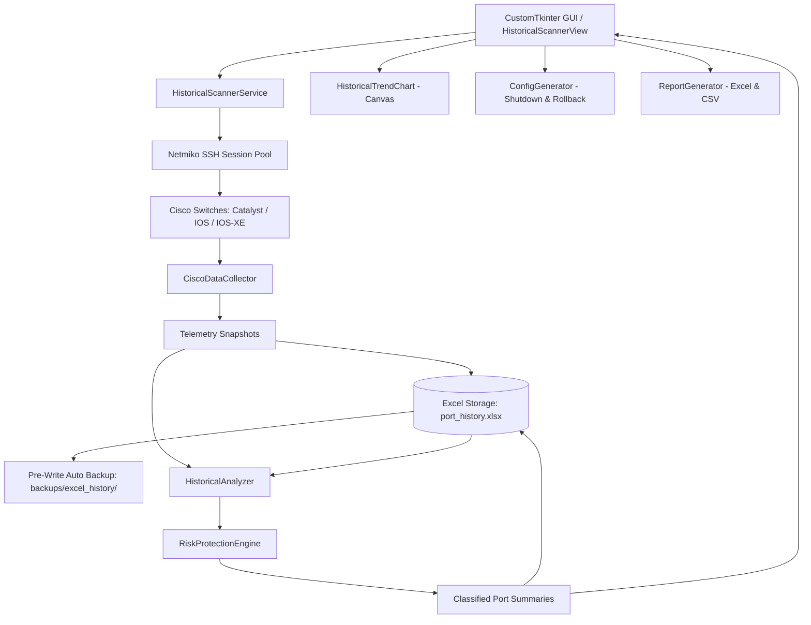

# Cisco Historical Unused Port Scanner

[](https://github.com/tdt111199/Cisco-Switch-Management-Tool/releases/latest)
[](https://www.python.org/)
[](https://www.microsoft.com/windows)
[](LICENSE)
[](https://www.python.org/dev/peps/pep-0008/)

A complete, enterprise-grade Python GUI desktop application for tracking, auditing, and analyzing switch port usage history across Cisco switches over time. 

**Zero SQLite or External Database** — Persistent storage is powered exclusively by a multi-sheet **Microsoft Excel (`port_history.xlsx`)** workbook with pre-write backups, atomic file replacement, and multi-criteria safety algorithms to reliably identify inactive ports and generate safe shutdown/rollback scripts without accidental network outages.

---

## 📑 Table of Contents

- [Project Overview](#-project-overview)
- [Key Features](#-key-features)
- [Architecture & Design](#-architecture--design)
- [System Requirements](#-system-requirements)
- [Installation](#-installation)
- [Quick Start](#-quick-start)
- [How to Build Standalone EXE](#-how-to-build-standalone-exe)
- [Download Pre-Built Release](#-download-pre-built-release)
- [Repository Structure](#-repository-structure)
- [Historical Scan Mechanism via Excel](#-historical-scan-mechanism-via-excel)
- [Multi-Criteria Inactive & UNUSED Classification](#-multi-criteria-inactive--unused-classification)
- [Protected Ports Mechanism](#-protected-ports-mechanism)
- [Safe Configuration & Rollback Generator](#-safe-configuration--rollback-generator)
- [Safety Warnings & Operational Principles](#-safety-warnings--operational-principles)
- [Visual Interface & Diagrams](#-visual-interface--diagrams)
- [Development Roadmap](#-development-roadmap)
- [Contributing](#-contributing)
- [License](#-license)

---

## 🔭 Project Overview

In enterprise network management, identifying and shutting down inactive access ports is essential for network hygiene, security hardening (preventing unauthorized physical access), and capacity planning.

However, **relying solely on instantaneous `down` or `notconnect` status is dangerous** — it often leads to disconnecting sleeping printers, conference room laptop drops, intermittently used workstations, or mission-critical links.

**Cisco Historical Unused Port Scanner** solves this problem by:
1. Performing concurrent batch scans across switches using Netmiko.
2. Appending telemetry snapshots to persistent Excel storage (`port_history.xlsx`).
3. Calculating multi-scan historical intelligence: `First Seen`, `Last Seen`, `Days Unused`, `Consecutive Unused Scans`, `Last Active Time`, and `Active Transitions`.
4. Enforcing the **Reset Rule**: if a port becomes active, the consecutive scan counter is immediately reset to 0.
5. Providing **Strict Multi-Criteria Exclusions**: Trunk, Uplink, EtherChannel, CDP/LLDP neighbors, and Protected ports are permanently excluded from shutdown proposals.
6. Generating **Review-Only CLI Configuration Scripts** with accompanying rollback scripts (`no shutdown`) — **Zero automated device modifications**.

---

## ✨ Key Features

- **Zero-Database Persistence (Excel `port_history.xlsx`)**:
  - `Port_History`: Full raw telemetry snapshot appended after each scan.
  - `Port_Summary`: Aggregated multi-scan intelligence and classification per port.
  - `Protected_Ports`: Persistent list of ports protected by network engineers.
  - `Scan_Log`: Audit trail of all scan execution metrics.
  - **Automated Pre-Write Backups**: Timestamped archive saved to `backups/excel_history/` prior to each modification.
  - **Atomic File Swapping**: Protects against file corruption during sudden system shutdowns or power loss.
- **Deep Cisco IOS/IOS-XE Telemetry Collection**:
  - Combines `show interfaces status`, `show interfaces description`, `show interfaces switchport`, `show etherchannel summary`, `show mac address-table`, `show cdp neighbors`, `show lldp neighbors`, and `show interfaces`.
  - Converts human-readable counter timers (`never`, `14w2d`, `3d05h`, `00:15:30`) into exact inactive days.
- **Smart State Machine & Reset Rule**:
  - Distinguishes permanently unused ports from intermittently active ports.
  - Automatically resets consecutive inactive counters upon reconnection.
- **Configurable Thresholds**:
  - Inactivity periods: `30 days`, `60 days (Recommended)`, `90 days`, `180 days`, or custom user-defined days.
- **Visual Analytics & Canvas Trend Chart**:
  - Hardware-accelerated CustomTkinter desktop interface (Dark/Light mode).
  - Canvas-based historical trend visualizer plotting `UNUSED`, `ACTIVE`, and `MONITOR` port counts over time.
  - Real-time KPI summary banner and per-switch unused rate metrics.
- **Safe CLI Script & Rollback Generation**:
  - Generates Cisco IOS `shutdown` scripts with audit description tags.
  - Generates parallel `no shutdown` rollback scripts.
  - Clipboard copy and `.cfg` file export.
- **Multi-Format Reporting**:
  - Formatted multi-sheet Excel reports with styled KPI dashboards.
  - Standardized UTF-8 BOM CSV exports.

---

## 🏛️ Architecture & Design



---

## 💻 System Requirements

- **Operating System**: Windows 10, Windows 11, or Windows Server 2016+ (64-bit).
- **Python (If running from source)**: Python 3.10, 3.11, 3.12, 3.13, or 3.14.
- **Memory**: Minimum 512 MB RAM (1 GB recommended).
- **Disk Space**: ~100 MB free space for persistent Excel storage and backups.
- **Network Access**: SSH connectivity (Port 22) to target Cisco switch management IPs.

---

## 📦 Installation

### Option A: Running from Source

1. **Clone the Repository**:
   ```powershell
   git clone https://github.com/tdt111199/Cisco-Switch-Management-Tool.git
   cd Cisco-Switch-Management-Tool
   ```

2. **Create a Virtual Environment**:
   ```powershell
   python -m venv .venv
   .\.venv\Scripts\Activate.ps1
   ```

3. **Install Dependencies**:
   ```powershell
   pip install --upgrade pip
   pip install -r requirements.txt
   ```

4. **Initialize Local Configuration**:
   ```powershell
   Copy-Item .env.example .env
   ```

---

## 🚀 Quick Start

### Launch the Dedicated Standalone Scanner
```powershell
python historical_scanner_main.py
```

### Launch the Unified Management Suite
```powershell
python main.py
```

---

## 🔨 How to Build Standalone EXE

The project includes an automated PyInstaller builder producing a self-contained `.exe` runnable on Windows without Python:

### Method 1: One-Click Build Script (`build.bat`)
Run the provided batch file in Command Prompt or PowerShell:
```cmd
build.bat
```
This script will automatically:
1. Validate Python and dependencies.
2. Run all 22 automated unit tests.
3. Bundle the application into `dist/CiscoHistoricalUnusedPortScanner.exe`.
4. Create the distribution ZIP archive in `release/`.

### Method 2: Manual PyInstaller Command
```powershell
python build_historical_scanner_exe.py
```

---

## 📥 Download Pre-Built Release

Pre-built standalone Windows binaries are hosted on GitHub Releases:

🔗 **[Download Latest Release (v1.0.0)](https://github.com/tdt111199/Cisco-Switch-Management-Tool/releases/latest)**

- **ZIP Package**: `CiscoHistoricalUnusedPortScanner-v1.0.0-win64.zip`
- **Standalone Binary**: `CiscoHistoricalUnusedPortScanner.exe` (SHA256 verified)

---

## 📂 Repository Structure

```
Cisco-Historical-Unused-Port-Scanner/
├── src/                               # Application Source Code
│   ├── core/                          # Core foundational modules
│   │   ├── crypto.py                  # Hardware-bound AES-128-CBC credential encryption
│   │   ├── inventory.py               # Switch device profile manager & Excel/CSV importer
│   │   ├── logger.py                  # Thread-safe logging engine
│   │   ├── scanner_models.py          # Data models (PortSnapshot, PortSummaryRecord, etc.)
│   │   ├── ssh_client.py              # Netmiko SSH client wrapper with timeout handling
│   │   └── task_runner.py             # ThreadPoolExecutor multi-device worker pool
│   ├── services/                      # Business logic & operational services
│   │   ├── scanner/                   # Historical port scanner engine
│   │   │   ├── cisco_collector.py     # Deep Cisco IOS/IOS-XE CLI collector & duration parser
│   │   │   ├── config_generator.py    # Safe Shutdown & Rollback CLI script generator
│   │   │   ├── excel_storage.py       # Zero-database multi-sheet Excel storage manager
│   │   │   ├── historical_analyzer.py # Multi-scan historical analyzer & reset rule
│   │   │   ├── historical_scanner_service.py # Batch coordinator
│   │   │   ├── report_generator.py    # Executive Excel & CSV report exporter
│   │   │   └── risk_protection_engine.py # Multi-criteria safety & classification rules
│   │   ├── backup_service.py          # Running/startup configuration backup service
│   │   ├── l2_config_builder.py       # Layer 2 configuration template builder
│   │   ├── restore_service.py         # Configuration restore with pre-restore snapshots
│   │   └── show_service.py            # CLI monitor show command service
│   └── gui/                           # Presentation layer (CustomTkinter)
│       ├── dialogs/                   # Modal dialog windows
│       │   ├── config_preview_dialog.py # Safe CLI script preview modal
│       │   ├── confirm_dialog.py      # Confirmation dialog
│       │   ├── device_dialog.py       # Switch device editor dialog
│       │   └── historical_port_detail_dialog.py # Port snapshot history viewer
│       ├── views/                     # Main GUI views
│       │   ├── backup_restore_view.py # Backup & restore management view
│       │   ├── cli_monitor_view.py    # Live CLI command viewer
│       │   ├── devices_view.py        # Device inventory management view
│       │   ├── historical_scanner_view.py # Primary historical unused port scanner view
│       │   ├── l2_config_view.py      # Layer 2 switch configuration view
│       │   ├── logs_view.py           # Real-time event log view
│       │   └── trend_chart_canvas.py  # Embedded Canvas historical trend chart widget
│       └── app.py                     # Main tabbed application window
├── assets/                            # Application icons, diagrams, and media
├── config/                            # Environment settings and configuration loaders
│   ├── __init__.py
│   └── settings.py
├── docs/                              # Technical documentation
│   ├── ARCHITECTURE.md                # Detailed architectural specifications
│   ├── HISTORICAL_SCAN_MECHANISM.md   # Excel storage schema & state machine rules
│   ├── SAFETY_AND_RISK_ENGINE.md      # Multi-criteria safety matrix & rollback guides
│   └── USAGE_GUIDE.md                 # End-user operational handbook
├── examples/                          # Sample device import templates (.xlsx, .csv, .json)
├── release/                           # Distribution packages (.zip and release notes)
├── tests/                             # Automated test suite (22 unit tests)
│   ├── test_core_and_services.py      # Tests for crypto, inventory, and L2 builder
│   └── test_historical_scanner.py     # Tests for collector, storage, reset rule, and classifier
├── .env.example                       # Environment configuration template
├── .gitignore                         # Comprehensive Python & Windows gitignore
├── build.bat                          # Automated build and packaging script
├── build_historical_scanner_exe.py    # PyInstaller packaging script
├── CHANGELOG.md                       # Release notes and version history
├── LICENSE                            # MIT License
├── main.py                            # Unified application launcher
├── historical_scanner_main.py         # Dedicated historical scanner launcher
└── requirements.txt                   # Python package dependencies
```

---

## 📊 Historical Scan Mechanism via Excel

### Persistent Excel Database (`data/port_history.xlsx`)
1. **`Port_History`**: Append-only snapshot ledger recording every interface attribute from each scan session.
2. **`Port_Summary`**: Current consolidated state of every port with historical metrics:
   - `First Seen`: Date when the port was first discovered.
   - `Last Seen`: Date of the most recent scan.
   - `Days Unused`: Total elapsed inactive days.
   - `Consecutive Unused Scans`: Continuous scan sessions remaining inactive.
   - `Last Active Time`: Date and time when the port was last detected in active state.
   - `Active Transitions`: Number of times the port toggled from inactive to active.
3. **`Protected_Ports`**: List of permanently protected ports excluded from shutdown proposals.
4. **`Scan_Log`**: Audit record of execution runs (total switches, ports, classifications, duration).

### The Crucial Reset Rule
```
Inactive Scan (Down) ──> Increment Consecutive Scans & Days Unused
Active Scan (Up)     ──> RESET Consecutive Scans = 0, Days Unused = 0, Update Last Active Time
```

---

## 🛡️ Multi-Criteria Inactive & UNUSED Classification

A port is marked **`UNUSED`** ONLY when meeting **ALL** of the following conditions:
1. Port operational status is `notconnect` or `down`.
2. Learned MAC address count is exactly **0**.
3. Traffic counters indicate zero or insignificant packet exchange.
4. Port is **NOT** configured as an 802.1Q trunk.
5. Port is **NOT** connected to an uplink or infrastructure neighbor (no CDP/LLDP discovery).
6. Port is **NOT** a Port-Channel or member of an EtherChannel bundle.
7. Port description does **NOT** contain protected infrastructure keywords (`core`, `uplink`, `wan`, `ap`, `router`, `firewall`, `server`, etc.).
8. Port is **NOT** present in the `Protected_Ports` sheet.
9. Continuous inactive duration (`Days Unused`) is **greater than or equal to the configured threshold** (e.g., 30/60/90/180 days).

---

## 🔒 Protected Ports Mechanism

- Network engineers can select any port directly in the GUI table and click **"🛡️ Bảo Vệ Cổng Chọn"** (Protect Selected Ports).
- The port is immediately assigned the `PROTECTED` status and recorded in the `Protected_Ports` Excel sheet.
- Protected ports are **permanently excluded** from all shutdown script generators.
- Protection status can be revoked at any time via **"🔓 Bỏ Bảo Vệ"** (Unprotect).

---

## ⚙️ Safe Configuration & Rollback Generator

> [!IMPORTANT]
> **Strict Read-Only Guarantee**:
> The tool will **NEVER** push configuration changes automatically to switches.

- **Shutdown Scripts**: Generated only for ports classified as `UNUSED`. Automatically tags port descriptions for auditability:
  ```cisco
  interface GigabitEthernet0/12
   description [UNUSED-SHUTDOWN-2026-09-09] Desk-B14
   shutdown
  ```
- **Rollback Scripts**: Simultaneously generated to restore original operation if required:
  ```cisco
  interface GigabitEthernet0/12
   description Desk-B14
   no shutdown
  ```

---

## ⚠️ Safety Warnings & Operational Principles

1. **Verify Before Execution**: Always review generated configuration scripts prior to applying them in production environments.
2. **Backups First**: While the application does not change switch configurations, verify that a valid switch running-config backup exists before applying manual changes.
3. **Multi-Scan Recommendation**: Perform at least two separate scans over a representative time window before taking action on ports to avoid shutting down devices with scheduled power-down cycles.

---

## 🗺️ Development Roadmap

- [x] Multi-Switch SSH concurrent scanning (Netmiko)
- [x] Zero-database persistent storage via Excel (`port_history.xlsx`)
- [x] Automated pre-write backup and atomic replacement
- [x] Multi-criteria historical classification engine (`ACTIVE`, `UNUSED`, `MONITOR`, `PROTECTED`, `TRUNK/UPLINK`, `PORT-CHANNEL`, `ERROR`)
- [x] Canvas-based historical trend chart visualizer
- [x] Safe shutdown and rollback configuration generator
- [x] Formatted multi-sheet executive Excel and CSV report exports
- [x] Standalone Windows `.exe` packaging
- [ ] Cisco NX-OS (Nexus) collector module
- [ ] Arista EOS and Juniper JunOS collector plugins
- [ ] SNMP polling fallback for legacy devices without SSH access
- [ ] Scheduled headless background cron scanner with email alerts

---

## 🤝 Contributing

Contributions are welcome! Please follow these guidelines:
1. Fork the repository.
2. Create a feature branch: `git checkout -b feature/amazing-feature`.
3. Commit your changes: `git commit -m "feat: add amazing feature"`.
4. Run tests: `python -m unittest discover tests -v`.
5. Push to your branch: `git push origin feature/amazing-feature`.
6. Open a Pull Request.

---

## 📄 License

This project is licensed under the MIT License - see the [LICENSE](LICENSE) file for details.
