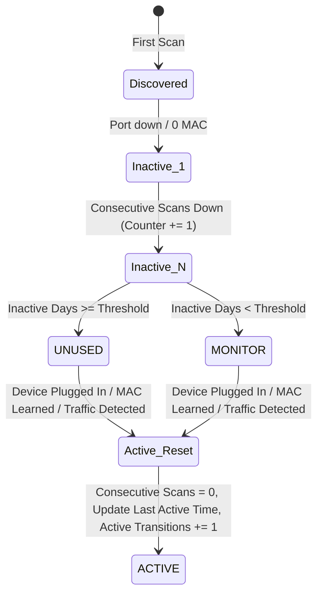

# Historical Scan Mechanism & Excel Storage

## 📊 Overview

Unlike traditional port auditing scripts that only check the instantaneous link status (which often leads to shutting down temporarily unplugged laptops, conference room ports, or sleeping printers), **Cisco Historical Unused Port Scanner** records snapshots across time into an Excel database (`data/port_history.xlsx`).

---

## 📑 Excel Storage Schema (4 Persistent Sheets)

### 1. `Port_History` (Append-Only Scan Snapshots)
Every scan appends full interface telemetry rows to this sheet:
- `Scan_Time`: Timestamp format `YYYY-MM-DD HH:MM:SS`
- `Switch_Name`, `Switch_IP`, `Interface`
- `Status`: `connected`, `notconnect`, `disabled`, `err-disabled`
- `Admin_Status`: `up`, `administratively down`
- `VLAN`, `Description`
- `MAC_Addresses`: Comma-separated list of learned dynamic and static MACs
- `In_Packets`, `Out_Packets`: Port packet counters
- `Last_Input`, `Last_Output`: Hardware counter durations (e.g., `never`, `14w2d`, `00:05:12`)
- `Last_Activity_Days`: Computed inactivity days from switch timers
- `Is_Trunk`, `Switchport_Mode`, `Is_PortChannel`, `PortChannel_ID`
- `CDP_Neighbor`, `LLDP_Neighbor`, `Neighbor_Info`
- `Speed`, `Duplex`, `Raw_Info`

### 2. `Port_Summary` (Aggregated Historical State)
Represents the current state and multi-scan aggregated intelligence for each unique `(Switch, Interface)` pair:
- `Current_Status`, `Current_VLAN`, `Description`, `Current_MAC`
- `Classification`: `ACTIVE`, `UNUSED`, `MONITOR`, `PROTECTED`, `TRUNK/UPLINK`, `PORT-CHANNEL`, `ERROR`
- `Days_Unused`: Total continuous inactive days
- `Consecutive_Unused_Scans`: Counter of consecutive inactive scans
- `First_Seen`: Timestamp when the port was first discovered
- `Last_Seen`: Timestamp of the latest scan
- `Last_Active_Time`: Timestamp when the port was last detected in active state
- `Active_Transitions`: Number of times the port changed from inactive to active
- `Is_Protected`, `Protection_Reason`, `Classification_Reason`

### 3. `Protected_Ports` (Exclusion List)
Stores ports explicitly protected by network engineers:
- `Switch_Name`, `Interface`, `Reason`, `Added_Date`, `Added_By`

### 4. `Scan_Log` (Audit Trail)
Summary records of each execution scan:
- `Scan_ID`, `Timestamp`, `Switches_Scanned`, `Total_Ports`, `Active_Count`, `Unused_Count`, `Monitor_Count`, `Protected_Count`, `Trunk_Count`, `Error_Count`, `Duration_Seconds`, `Status`, `Notes`

---

## 🔄 The Reset Rule (Crucial Safety Logic)

- If a port transitions from inactive to active (`status == connected`, learned MAC, or traffic detected):
  1. `Consecutive_Unused_Scans` is immediately **reset to 0**.
  2. `Last_Active_Time` is updated to the current scan timestamp.
  3. `Days_Unused` is reset to 0.
  4. `Active_Transitions` is incremented by 1 (identifying intermittent ports like laptop docks or projectors).
